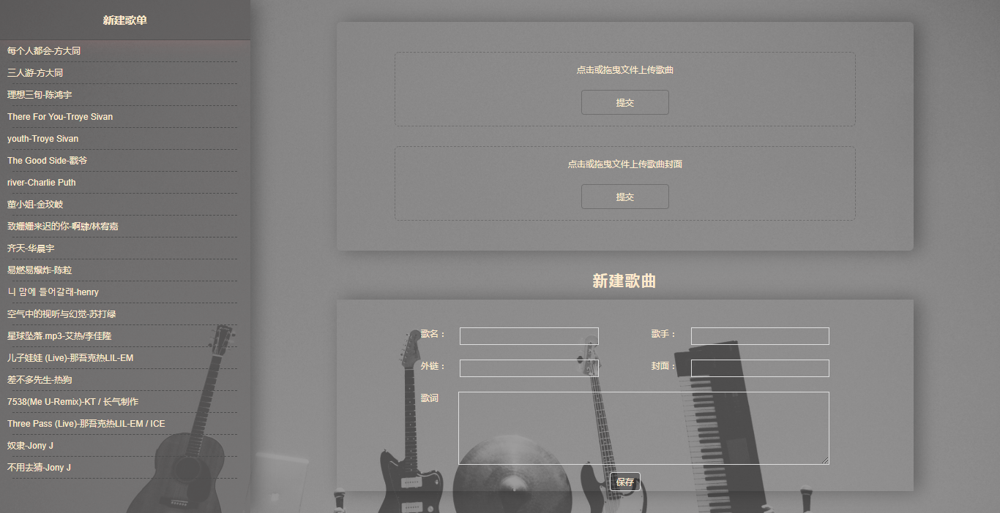
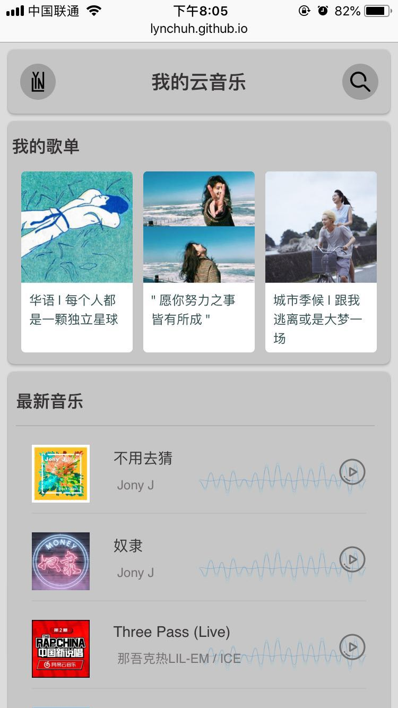
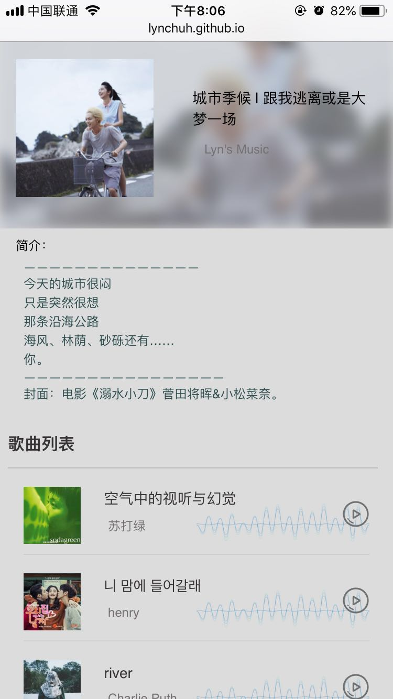
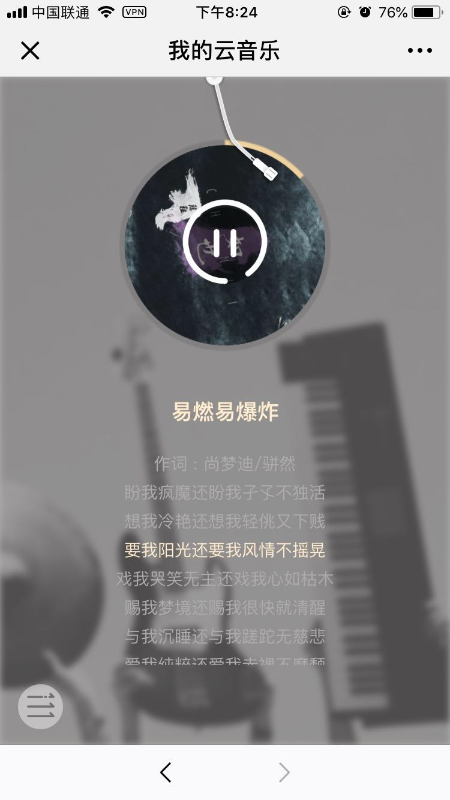

## 我的云播放器
---------
> 这个项目是实际仿网易云的，但UI我自己找设计稿重新改了。歌曲及歌单的数据存储使用七牛和leancloud两个数据库进行部署。
本项目包含了管理端上传页面，但由于个人账号隐私问题，暂时无法提供token实现上传功能。
### preview






[项目在线演示地址](https://lynchuh.github.io/projectPreview/music-player/)
### 项目运行
```
git clone https://github.com/lynchuh/music-player.git
cd music-player
npm install
npm i -g http-server 
http-server -c-1
open http://localhost:8080/src
```
### 功能实现
- 歌单列表关联
- 在线最新歌曲
- 播放页面封面旋转显示
- 歌词滚动显示
- 歌曲进度条显示
- 循环播放控制

### 涉及技术点
- 使用元素js&jQuery
- MVC架构
- EentHub 发布/订阅事件
- canvas绘图
- CSS 3 动画
- audio媒体事件
